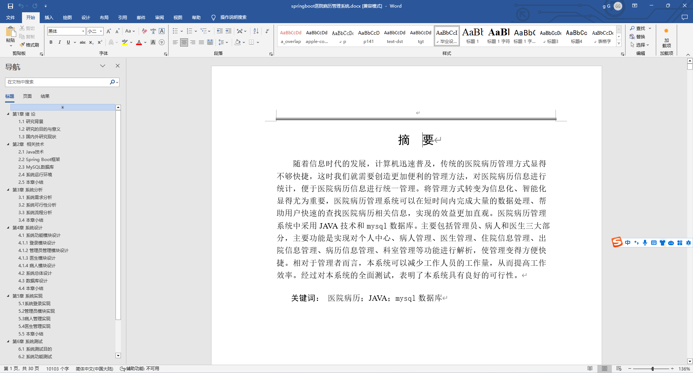
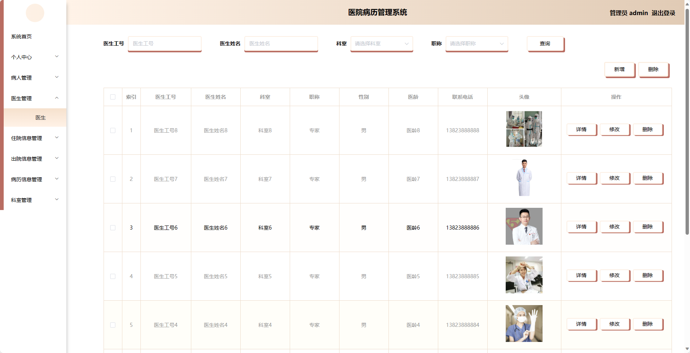
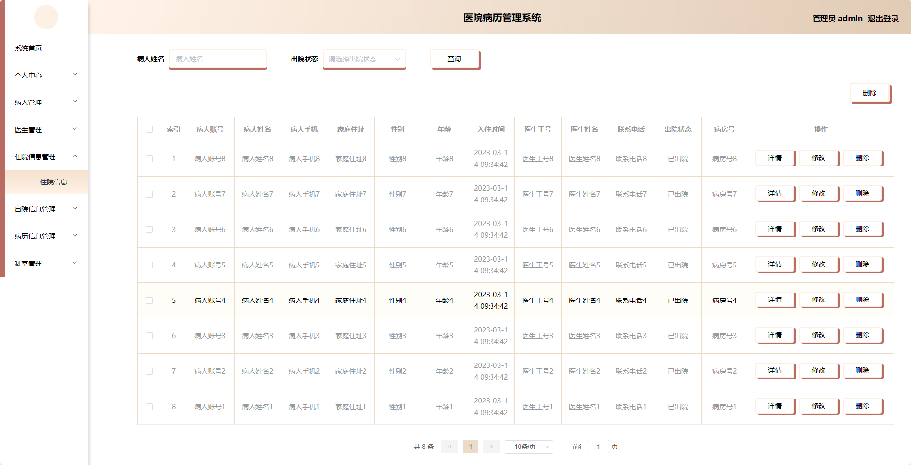
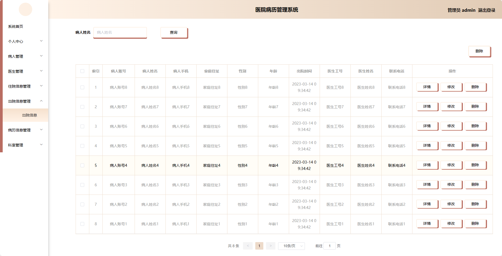
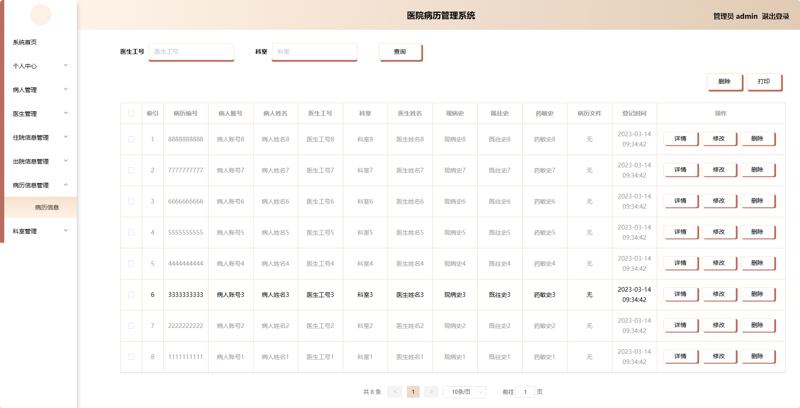
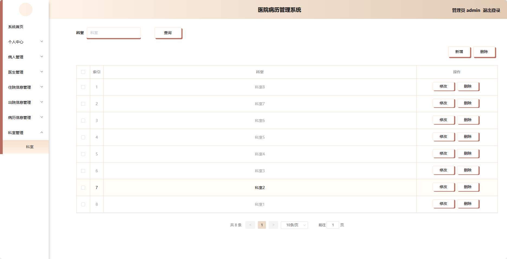
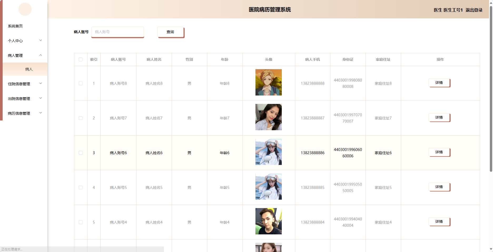
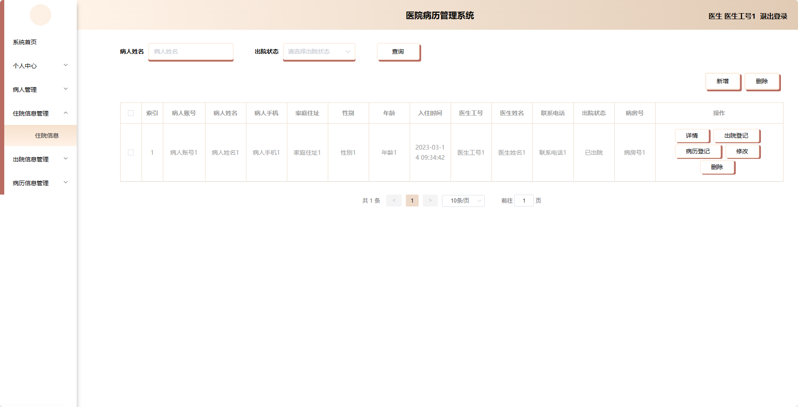
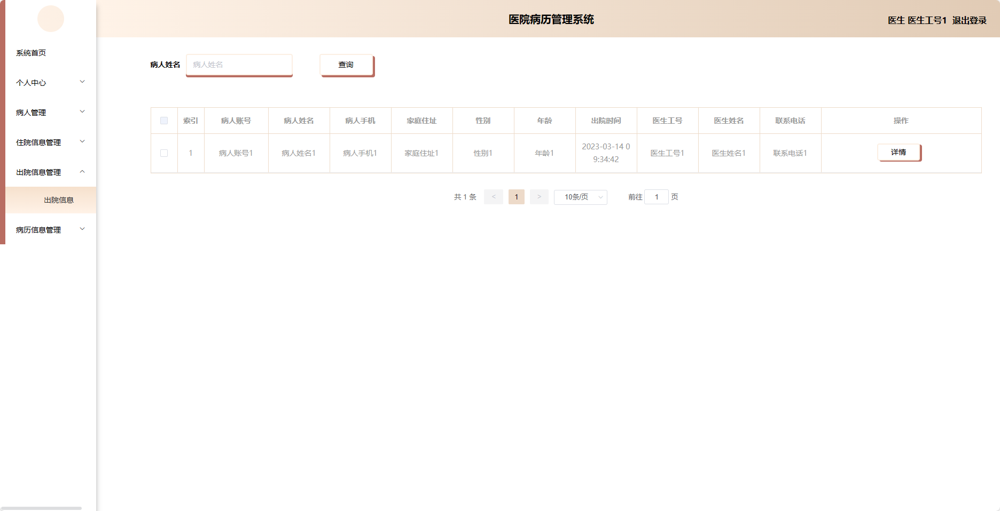

## 基于SpringBoot的医院病历管理系统(程序+报告)

###  获取sql数据库文件: 从戎源码网 (https://armycodes.com/) QQ: 386869957 QQ群: 377586148
###  所有系统地址: (https://github.com/YuLin-Coder/AllProjectCatalog) 
###  所有项目以及源代码本人均调试运行无问题 可支持远程安装部署调试、定制修改、代码讲解

## 项目介绍
基于SpringBoot的医院病历管理系统，系统包含两种角色：管理员、医生、病人,主要功能如下。

### 【管理员】:
- 个人中心：管理员可以管理个人信息，修改密码等。
- 病人管理：管理员可以管理病人的信息，包括添加、编辑和删除病人信息。
- 医生管理：管理员可以管理医生的信息，包括添加、编辑和删除医生信息。
- 住院信息管理：管理员可以管理病人的住院信息，包括入院日期、床位分配等。
- 出院信息管理：管理员可以管理病人的出院信息，包括出院日期、离院方式等。
- 病历信息管理：管理员可以管理病人的病历信息，包括病情描述、诊断结果等。
- 科室管理：管理员可以管理医院的科室信息，包括添加、编辑和删除科室信息。

### 医生角色：
- 个人中心：医生可以管理个人信息，修改密码等。
- 病人管理：医生可以管理自己负责的病人信息，包括查看、编辑和删除病人信息。
- 住院信息管理：医生可以管理病人的住院信息，包括入院日期、床位分配等。
- 出院信息管理：医生可以管理病人的出院信息，包括出院日期、离院方式等。
- 病历信息管理：医生可以管理病人的病历信息，包括病情描述、诊断结果等。

### 病人角色：
- 个人中心：病人可以管理个人信息，修改密码等。
- 住院信息管理：病人可以查看自己的住院信息，包括入院日期、床位分配等。
- 出院信息管理：病人可以查看自己的出院信息，包括出院日期、离院方式等。
- 病历信息管理：病人可以查看自己的病历信息，包括病情描述、诊断结果等。

## 项目技术
- 编程语言：Java
- 数据库：MySQL
- 项目管理工具：Maven
- 前端技术：HTML、CSS、JavaScript、Jquery、Vue
- 后端技术：Spring、SpringMVC、MyBatis

## 运行环境
- JDK版本：JDK1.8及以上
- 开发工具：IDEA、Ecplise、Myecplise都可以
- 数据库: MySQL5.7及以上
- Maven：maven3.0及以上
- Node：14.14.0及以上

## 运行截图

